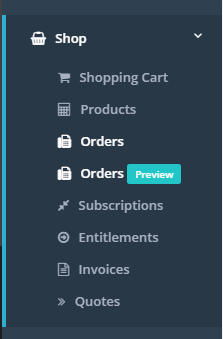
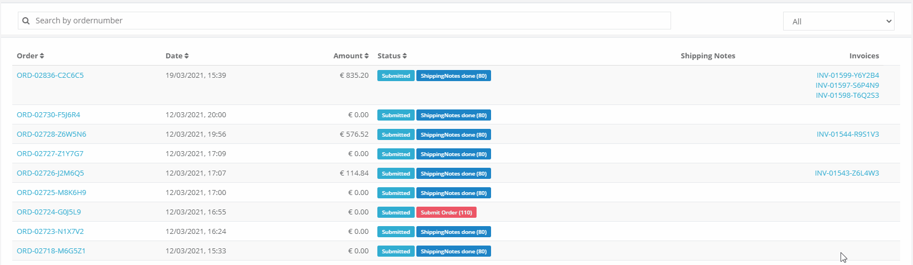
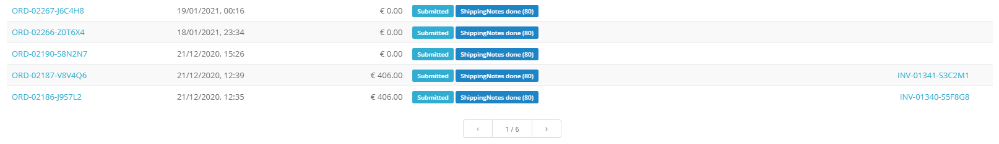
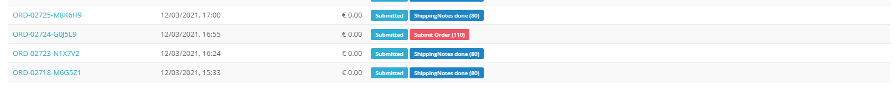
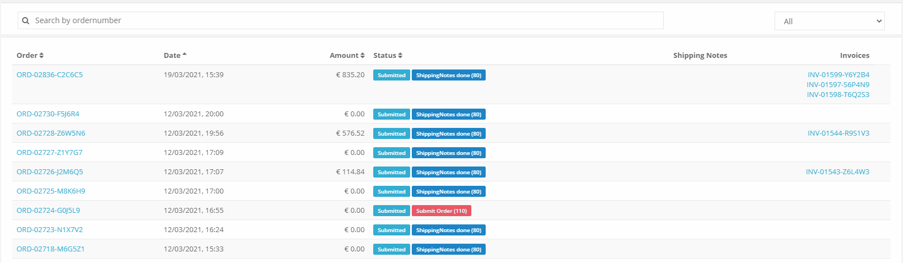

# fiskaltrust.Portal - Sprint 95
_March 8, 2021_

**New orders page in public preview**

In this sprint we have been focusing to further improve the new orders page to being able to put it into public preview so that all of our users can use it.

## Features

### E-Commerce 
- [New orders page in public preview](#new-orders-page-in-public-preview)
- [Search by ordernumber](#search-by-ordernumber)
- [Filter on order state](#filter-on-order-state)
- [Rendering all records available & pagination](#rendering-all-records-available-&-pagination)
- [Highlight failed orders](#highlight-failed-orders)
- [Sorting orders](#sorting-orders)

## E-Commerce

### New orders page in public preview

After adding the latest changes we are happy to announce that we can put the new orders page into public preview. 

We will have both views available until end of march to make sure that we are not dropping any features that users have been using without our knowledge. In the next sections we will add additional details on the added features of the new orders page.

All mentioned funcitonalities are only available in the new orders page.

### Search by ordernumber

One of the most requested features was the ability to search for ordernumbers. This is especially helfpul if users want to search for specific orders. As soon as a ordernumber is typed into the searchbox the view is updated and if a matching order is found it is displayed.

### Filter on order state

Another improvement we made is adding a combobox that gives users the possibility to filter orders. If users do see many orders it is usually hard to focus on the ones that are important. As shown in the clip bellow it is possible to filter for failed orders now.

### Rendering all records available & pagination

In the past it was not possible to show more than 500 records. Especially for larger customers it can happen that they have a very large amount of orders. To still being able to keep the loading time slow we added the option to navigate through orders with pagination. 

### Highlight failed orders

In addition to the new filtering feature we also added an indicator that shows if the order has been executed succesfully. With this new indicator users should be able to see if something has gone wrong with their order and get in touch with our support to get it fixed. Most of the time customer action shouldn't be required since we are monitoring failed orders internally.

### Sorting orders

While users have been able to use sorting in the past, this sort was only performed at the clientside. For large datasets this means that the sorting was only done on the loaded data. If the data was fully available on the clientside this wasn't an issue, but in case of data not being loaded the sorting was only done for a portion of the data. This is resolved now and the sorting is done on the serverside.

## Next steps
In the next weeks we will focus on improving the performance of the portal in addition to a brand new component that should greatly enhance the rollout experience. Startin by today you should see two navigation elements. 

## Feedback
We would love to hear what you think about these improvements and fixes. To get in touch, please reach out to [info@fiskaltrust.at](mailto:info@fiskaltrust.at).