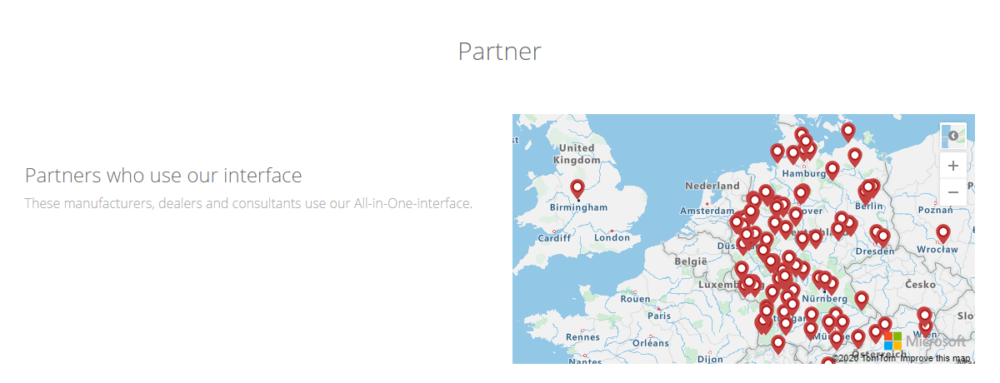
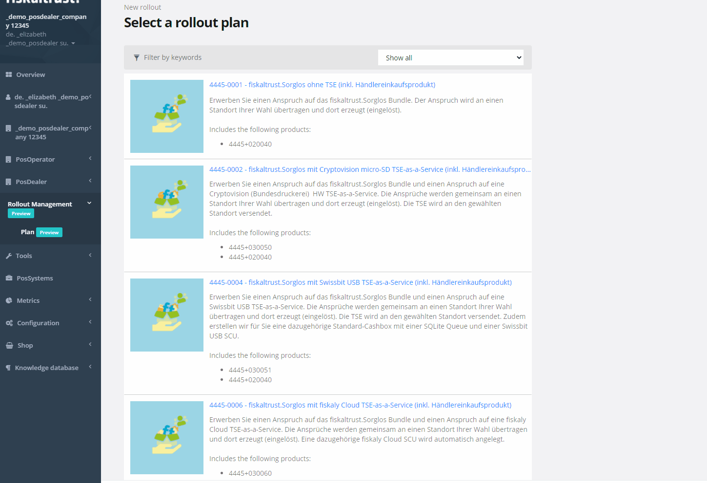
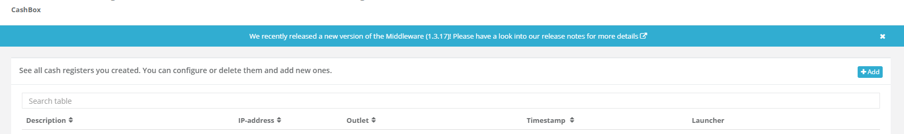
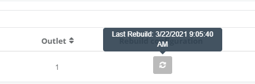
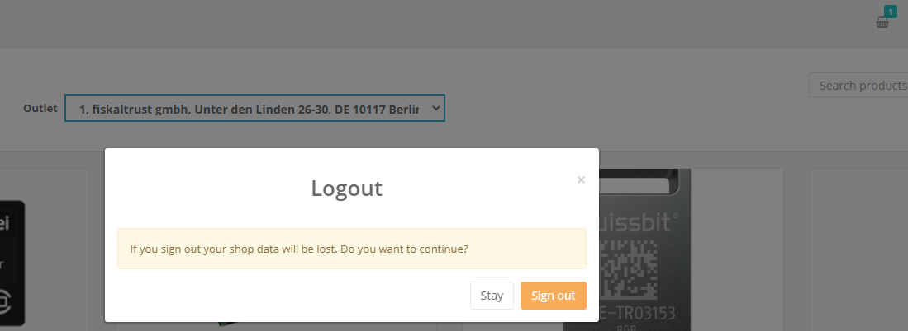
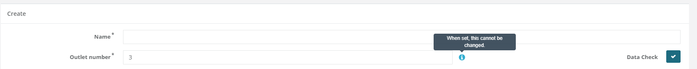
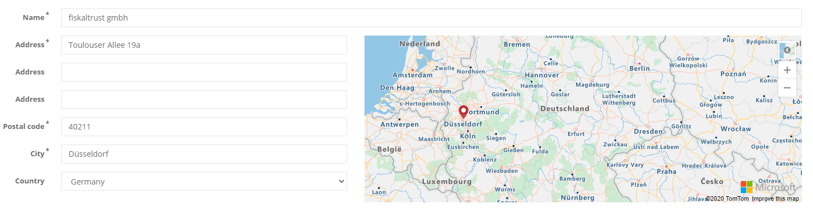

# fiskaltrust.Portal - Sprint 96
_March 22, 2021_

**Rollout Management in public preview**

In this sprint, we have introduced the Rollout Management feature that should greatly improve the rollout experience for PosDealers. 

## Features

### General
- [Show ft-Partners on Main Page](#show-ft-partners-on-main-page)
### Rollout platform
- [Rollout planning in public preview (DE)](#rollout-planning-in-public-preview-de)

### Middleware Configuration
- [Inform users about new middleware releases (DE)](#inform-users-about-new-middleware-releases-de)
- [Show Last Rebuild Time of CashBox](#show-last-rebuild-time-of-cashbox)

### E-Commerce 
- [Warn users before logging out if Products are in the cart](#warn-users-before-logging-out-if-products-are-in-the-cart)

### User Management
- [Highlight the unalterability of outletnumbers](#highlight-the-unalterability-of-outletnumbers)
- [Replaced legacy map with enhanced map control](#replaced-legacy-map-with-enhanced-map-control)

## General

### Show ft-Partners on Main Page

Since our partner network is currently rapidly growing we wanted to give users the chance to see where our partners are located. If users are navigating to the main page of the different markets (https://portal.fiskaltrust.de) they should see a map with all the partners in the specific market. 

## Rollout Platform

### Rollout planning in public preview (DE)
With this sprint we are establishing a new baseline for the future rollout experience. Since the main purpose of portal is to make the rollout as easy as possible we have thought about how we can make things easier. One of the main areas of improvement that we identified is the purchasing and asigning of products to connected PosOperators. In the past this involved several steps and a pretty complicated process that was error-prone. With the new Planning feature of the Rollout Management we hope that we can improve this. 

Starting by today users should see a new navigation element Rollout Management with a submenu Plan. When navigating to this page there is an easy 4-steps process to perform the rollout for as many outlets as needed.

- Select the rollout base plan - We have defined a new entity that wraps several products that are commonly purchased. Users can use either the dealerpackage based or the move entitlements approach.
- Select the account - This page includes all connected posoperators as well as the current users account
- Select the outlets - This page can be used to select one or more outlets that should be included in the rollout. Each of the selected outlets will be included in the quote
- Create quote - In the last step users can asign a specific name to the quote that will be created. The summary page shows all information for the current rollout. 

After creating the quote users can just put the quote into the cart and should be good to go.

We hope that this process greatly improves the rollout experience of portal users and we plan to add additional features like including templates, defining favorites and reporting on the rollout state for connected posoperators.

## Middleware Configuration

### Inform users about new middleware releases (DE)

To make sure that users that are using the ft-Middleware are aware of latest releases the PosCreator Experience Team reached out to us to dicuss how we can improve the portal to highlight new release of the middleware. After several ideas we decided to display the information in the configuration section of the portal so if users are navigating to one of the subpages they will be informed about new releases and can directly navigate to the release notes. By clicking on the X icon it is possible to hide this information.

### Show Last Rebuild Time of CashBox

After the rollout of the new cashbox rebuild indicator we got the feedback that some of our users have been using the timestamp for several manual checks. We added back the timestamp to the button so that users are able to see when the last rebuild happened.

## E-Commerce

### Warn users before logging out if Products are in the cart

Some of our customers reached out to us that they accidentaly logged out of their user while having many items in the cart. Because of the fact that the cart isn't persisted this leads to a lost state. This is especially problematic while surrogating since the location of the logout button and the "go-back" button are very close. To prevent these unintended logouts while having something in the cart we added a warning that will be shown in case users are logging out while something is in the cart. 

## User Management

### Highlight the unalterability of outletnumbers

Users can define multiple fields for outlets. One of them is the so called outletnumber. This field is used for internally identifying the connection between middleware components and the outlet. Therefore this field cannot be changed after it has been asigned. To make sure that users are aware of this limitation we added additional information to the outlet dialogs.

### Replaced legacy map with enhanced map control

In the past we have been using the Bing Maps control to indicate the current location of accounts. We have replaced this legacy control by a new component.

## Next steps
In the next weeks we will focus on improving the performance of the portal.

## Feedback
We would love to hear what you think about these improvements and fixes. To get in touch, please reach out to [feedback+portal@fiskaltrust.cloud](mailto:feedback+portal@fiskaltrust.cloud).

