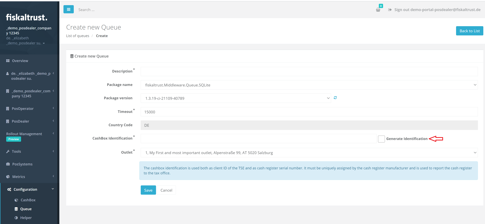
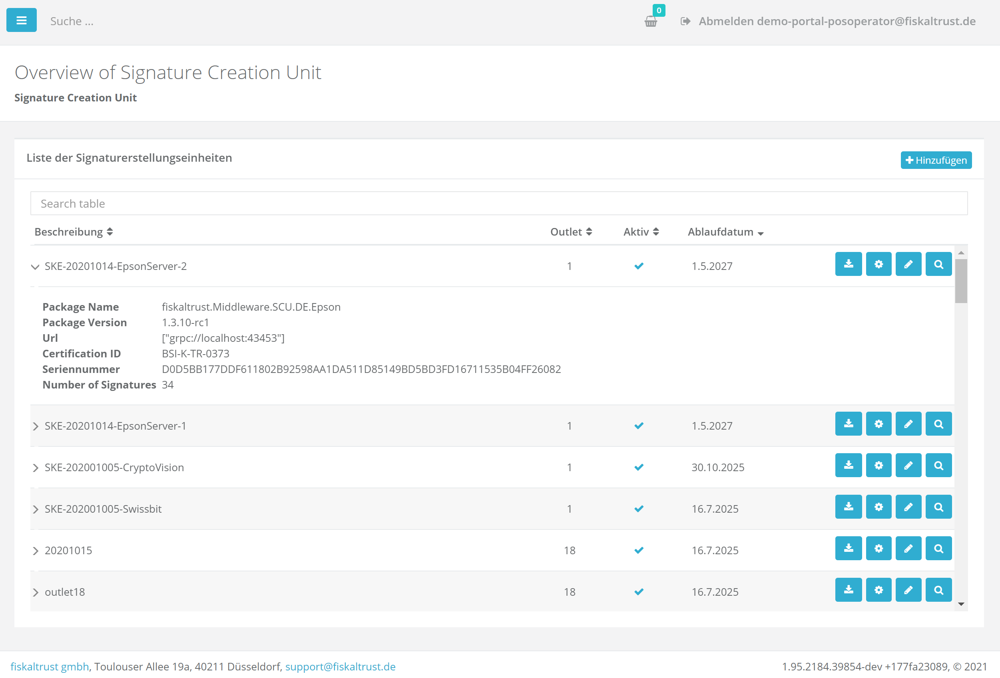

# fiskaltrust.Portal - Sprint 97
_April 5, 2021_

**Usability improvements**

In this sprint, we have focused to improve overall usability and to make sure that users have the same capabilities to generate unique CashBoxIdentifications as they have when using ft-Helipad.

## Features

#### Autogenerate unique CashBoxIdentification for QueuesDE (DE)

In Germany it is required by law to use a vendor-unique identifier for the CashBoxIdentification. Now, the new functionality allows users to generate themselves a CashboxIdentification easily in the Portal. The generated identifier is based on the queueid and is globally unique.

 

#### Reworked SignaturCreationUnit DE page (DE)

The SignaturCreationUnit DE page was been reworked. Even though it appears to be similar with the old page, response times of the page are faster and the overall data overview is impoved. Aside from previous functionalities that are still there, some additional points can be found:

- Outlet number is shown inside of the table
- Serial number is moved to expander
- Certification identification and number of the signatures are added to expander

 

#### Wrong expirationdate shown for CryptoVision SCU (DE)

Until now, the expiration date for SCUs has been shown in the German Portal. Even though this information on whether the SCU is about to expire, sometimes the wrong date is displayed. This has been fixed, and the correct expiration date is now being displayed.

#### Hide unsupported helpers in DE (DE)

There are Global Service 1.2 helpers that do not work with the Middleware 1.3 for Germany, and thus should not be displayed in this market, as they create confusion since they are not really available for usage in Portal. These are not displayed anymore in the German Portal (Sandbox & Production).

## User Management

### Icons are not highlighted while changing user claims

Until now, raw icons were not highlighted when a user was changing claims. Icons were highlighted after the page was reloaded. This has now been modified, so when a user us changing the claims, the relevant changes are shown by highlighted icons showing up in the employee list without needing to refresh the page.

## Feedback
We would love to hear what you think about these improvements and fixes. To get in touch, please reach out to [info@fiskaltrust.at](mailto:info@fiskaltrust.at).

