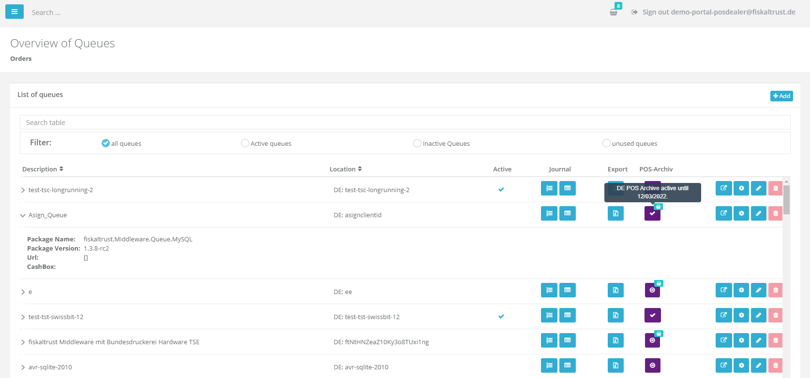
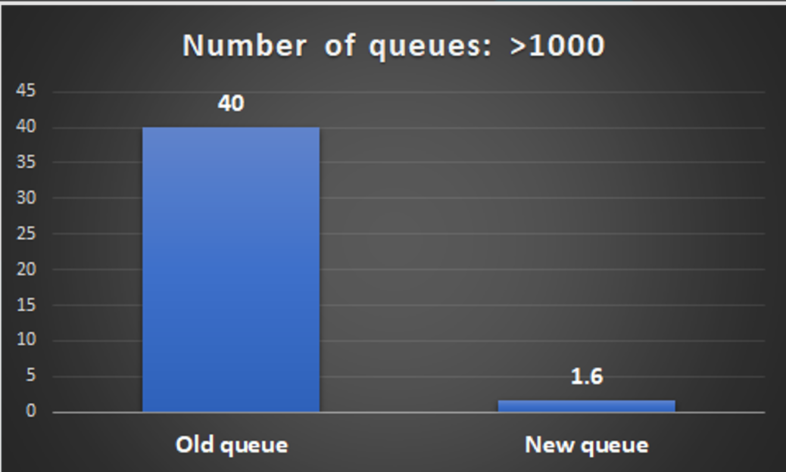

The goal this past Sprint was to work on the migration of the Queue page to React, as part of our effort to improve performance of roll-out relevant Portal sections.

## User Management

### Email confirmation

Very often customers were entering accidentally a misspelled email address and were thus unable to login. By adding a confirmation email so the user has to submit it for a second time. An error will be issued if the two entries don’t match 

### New React-based index page for Queue DE

In the new React-based index page for Queue in the German market, users will be able to quickly overview all queues, so that they can search them, configure them and also get the most important information. All previous UI/UX elements and functionalities are kept:

In the following graph the difference in the speed (in seconds) compared to the previous Queue Page versus the new React-based one can be shown:

