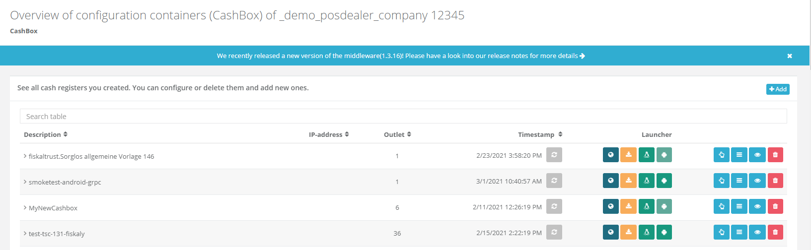

# fiskaltrust.Portal - Sprint 99
_May 3, 2021_

**Usability improvements for various features**

In this sprint, we have introduced several usability improvements, especially when working with the AO148 generator, or the entitlements history page.

## Features

### Middleware Configuration
- [Inform users about new middleware releases (DE)](#inform-users-about-new-middleware-releases-de)
- [Visual improvements of Queue page (DE)](#visual-improvements-of-queue-page-de)

### E-Commerce 
- [Entitlement History is not showing all entitlements](#entitlement-history-is-not-showing-all-entitlements)

### Tools
- [Improving usability of AO148 Generator (DE)](#improving-usability-of-ao148-generator-de)

## Middleware Configuration

PosCreators can now stay informed on new Middleware releases (DE), getting updates on new features and bug fixes for which they might have been waiting. For this purpose, a new notification bar has been added on every configuration page (Cashbox, Queue, Helper, SCU, Template, Configuration update). This bar will be shown whenever a new version of the Middleware is available. Users will be able to click on it and then get redirected to the latest release notes. The bar can be closed from the user and it won’t reappear again till a new Middleware version is available.

### Visual improvements of Queue page (DE)
 
Some minor visual improvements of the Queue page (DE) have been implemented. We invested some time in improving the way our tables are displayed in the Queue page (DE). Visually nothing major should have changed but we managed to reduce updates on the tables and reduced necessary memory. A wider range of monitor resolutions should now also be supported. 

## E-Commerce

### Entitlement History is not showing all entitlements

In the shop, under Entitlement History not all Entitlements were shown aside from the ones with Remaining-Terms greater than 0.0. This has been modified and now all entitlements are shown in the Entitlement History page.

### Improving usability of AO148 Generator (DE)
 
The AO148 Generator (DE) page’s UX and usability is improved including fixing minor issues like adding titles in the generated documents, descriptions of the filled-in fields in the generated documents as well as correcting spacings, formatting and translations.

## Next steps
In the next weeks we will focus on integrating a Knowledge Base into portal. This will contain knowledge articles for any number of issues our customers encounter when using our products and services, with the purpose of troubleshooting those issues and of adressing topics that cannot be solved with the help of the product documentation.

## Feedback
We would love to hear what you think about these improvements and fixes. To get in touch, please reach out to [feedback+portal@fiskaltrust.cloud](mailto:feedback+portal@fiskaltrust.cloud).
