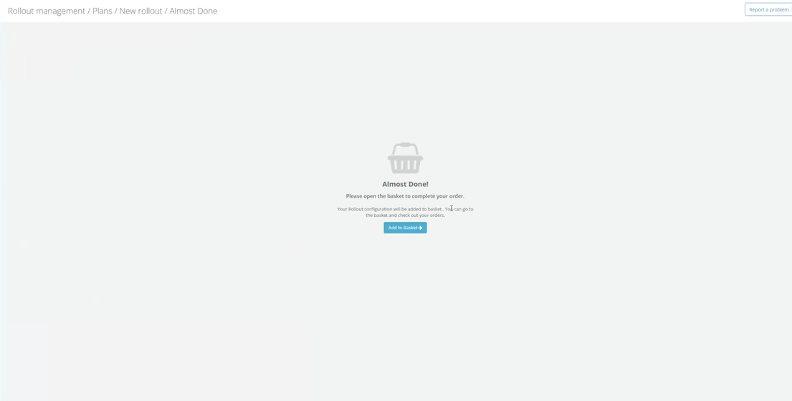

## Summary

Creating a quote at the end of a business rollout now takes you straight to your basket. The extra "Almost Done!" confirmation page is gone, so checkout is one click shorter.

<!--truncate-->

## Why This Matters

When you finished configuring a business rollout and created a quote, the portal used to stop on an intermediate "Almost Done!" page. That page did nothing except offer a single "Add to Basket" button — the same action the basket already lets you perform, since your quotes are listed right there in the checkout view. It was an extra screen and an extra click standing between you and completing your order, with no information or choice to justify it.

We removed that detour. Now, the moment your quote is created, its full configuration is loaded into your basket and you are taken directly to the cart, ready to review and check out. The result is a quicker, more direct path from "I've planned my rollout" to "I'm ready to order" — less clicking, less waiting, and no dead-end screens.

## What Changed

- After you create a quote at the end of a business rollout, you now land directly in the basket with your rollout configuration already added — there is no longer a separate "Almost Done!" page to click through.
- The button at the end of the rollout summary now reads **"Create quote & go to basket"**, so it's clear up front that a single click both creates your quote and opens the cart.
- While this happens you'll see a short progress indicator for each step — first "We are creating your quote", then "Adding to basket".
- If your quote is created but adding it to the basket runs into a problem, your quote is never lost or duplicated: the button simply offers to add the existing quote again, so retrying can't create a second quote.

## Impact

This affects anyone who creates quotes through the business rollout flow in Rollout Management, across all markets. There's nothing you need to do — the faster flow applies automatically the next time you complete a rollout. Your quotes and orders behave exactly as before; only the path to your basket is shorter.
