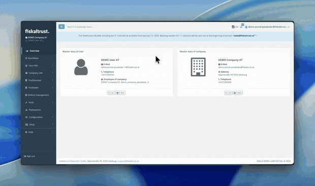

## Summary
When you act on behalf of one of your operators, the fiskaltrust Service Portal now shows a clear, persistent banner across every screen — so you always know exactly whose account your actions affect.
<!--truncate-->
## Why This Matters
As a dealer or consultant, you can step into one of your operators' accounts to help them set things up or resolve an issue. Until now, the portal looked exactly the same whether you were working in your own account or in an operator's — nothing on screen told the two apart. That made it easy to lose track of which context you were in, and to make changes against an operator's account while believing you were in your own.

The new banner removes that ambiguity. At a glance, and on every page, you can see whose account you are currently working in. It turns a subtle, error-prone situation into one that is obvious and safe — acting as a real safeguard, not just a label.

## What Changed
- Whenever you are acting on behalf of an operator, a banner stays pinned to the top of the portal. It remains visible no matter where you navigate.
- The banner names the operator and states the consequence in plain language: *"You are acting on behalf of [Operator]. Everything you do here affects only this operator's account."*
- To leave the operator's context, use **Back to your account** in the top bar. The banner disappears the moment you return to your own account.

## Impact
This update affects dealers and consultants who act on behalf of their operators. No action is required on your side — the banner appears automatically whenever you are working in an operator's account, and disappears as soon as you return to your own.

## Availability
The banner is already live in the **Sandbox** environment, where you can try it out today, and will be rolled out to **Production** across all markets over the coming days.
