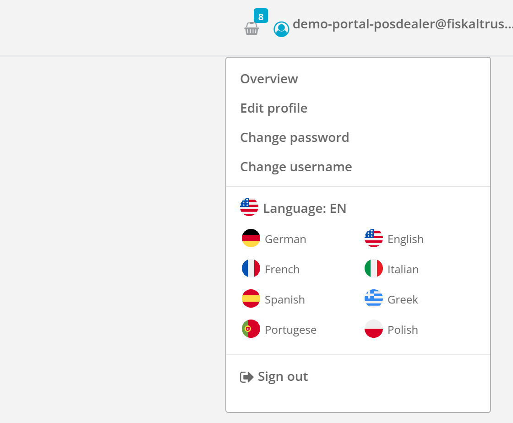
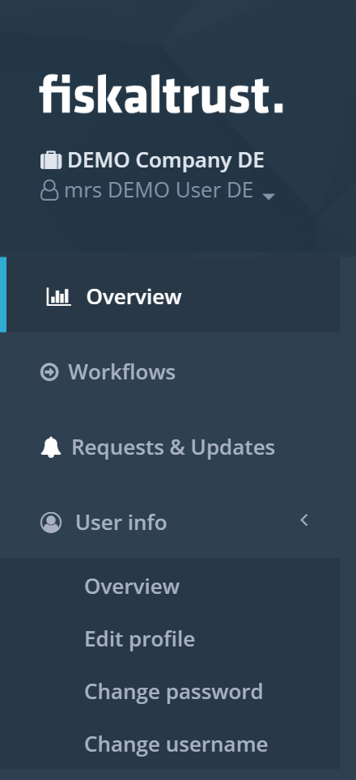
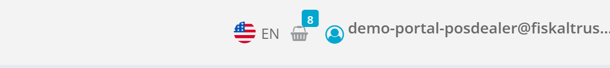

## Summary

Everything that is about *you* as a portal user now lives in one place: the menu under your name in the top-right corner. It holds your profile, password and user name settings and the language switch, next to Sign out. The "User info" group has left the sidebar, and the lone language flag has left the top bar.

<!--truncate-->

## Why This Matters

The portal has two kinds of settings. Some belong to the **company** you work for: outlets, employees, payment methods, middleware configuration. Others belong to **you personally**: your name and contact details, your password, your login name, and the language you want the portal to speak. Until now those personal settings were scattered. Profile, password and user name sat in a "User info" group in the left sidebar, between the company sections. The language switch was a small flag icon in the top bar, easy to overlook and unrelated to anything around it.

That is not where people look for them. In practically every application you use, the menu under your own name in the top-right corner is where you manage your account. So we moved the personal settings there. Open the menu under your name and you find your profile, your password, your user name, the language picker and Sign out, in that order. One place, no hunting.

The sidebar benefits too. It is the map of what the portal can do for your business, and it just became one group shorter. The "User info" group was visible to every role but opened only a few times a year, and it took the same space as sections you use daily. Removing it makes the sidebar easier to scan. The top bar also loses one control: the language flag, the shopping basket and the user menu were three separate drop-downs side by side; now there are two.

## What Changed

- The menu under your name in the top-right corner now lists **Overview**, **Edit profile**, **Change password** and **Change username**, followed by a **Language** section and **Sign out**.
- The Language section shows your current language with its flag and offers every language the portal supports. Pick one and the portal reloads in that language, exactly as the old flag icon did.
- The "User info" group is no longer shown in the left sidebar. The pages themselves are unchanged and keep their addresses, so any bookmarks still work.
- The standalone language flag in the top bar is gone; use the Language section in the user menu instead.
- The "Sign out" button at the bottom of the sidebar is gone as well. Sign out from the user menu, where it has always been available too.
- The small drop-down under your company name in the sidebar header no longer repeats the "Profile" link. It keeps the entries that are about your company context: switching between your accounts and adding another account.
- The user menu can be opened with the keyboard: move focus to your name and press Enter or Space.

For comparison, this is where these settings used to be: a "User info" group in the sidebar and a separate language flag in the top bar.

## Impact

This applies to all markets and to every portal user, whatever your role. Nothing needs to be done on your side. If you are used to the sidebar entry, look one place from now on: the menu under your name, top right. Support articles and training material that point to "User info" in the sidebar will be updated over the coming weeks.
